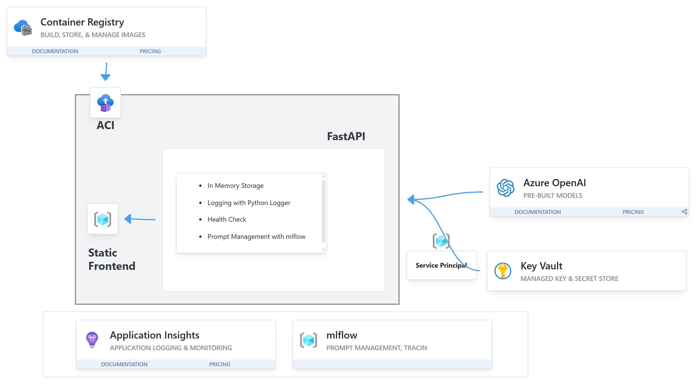

# AI Career Companion – End-to-End Guide (Azure)

## 📌 Problem Statement

Enterprises face challenges in **scalable career development and retention**.

* Employees lack visibility into career growth opportunities.
* Managers spend significant time creating reviews and development plans.
* HR struggles to analyze skill gaps across large workforces.

---

## ✅ Proposed Solution

The **AI Career Companion** is a **prompt-first enterprise application** that:

* Analyzes **skills gaps** for employees.
* Generates **personalized upskilling plans**.
* Assists managers with **performance reviews**.
* Simulates **mentorship guidance**.

It is implemented with **FastAPI + Azure OpenAI + MLflow + Key Vault + App Insights**, containerized, and deployed on **Azure Container Instances (ACI)**.

---

## 🚀 Approach

1. **Prompt-Centric Design**
   Prompts are versioned and managed with MLflow. The backend dynamically loads prompts by alias.
2. **Secure Integration**
   Keys and secrets are stored in **Azure Key Vault**; credentials are handled via Service Principal.
3. **Cloud-Native Deployment**
   Backend packaged into Docker image → pushed to **ACR** → deployed to **ACI**.
4. **Monitoring & Observability**
   Telemetry captured via **Application Insights**.

---

## 🔧 Prerequisites

* **Azure CLI** installed and authenticated (`az login`)
* **Docker** installed and running
* **Python 3.10+** installed
* **Append Learning** (for local development)
* **jq** CLI (for parsing JSON outputs in shell scripts)

---

## 📦 Azure Services Used

| Service                             | Purpose                                                                |
| ----------------------------------- | ---------------------------------------------------------------------- |
| **Azure Container Registry (ACR)**  | Store Docker images for backend.                                       |
| **Azure Container Instances (ACI)** | Run containerized backend with public endpoint.                        |
| **Azure Key Vault**                 | Store sensitive values (OpenAI API key, MLflow URI, App Insights key). |
| **Azure OpenAI**                    | LLM inference with GPT-4o-mini deployment.                             |
| **Application Insights**            | Monitor requests, latency, and logs.                                   |




---

## ⚙️ Environment Variables

We will use a `.env` file to manage environment variables. The backend reads from this file automatically.

* `OPENAI_ENDPOINT` → fetched automatically from Azure OpenAI resource.
* `OPENAI_KEY` → stored in Key Vault, store Key Name in `.env`.
* `APPINSIGHTS_KEY` → stored in Key Vault, store Key Name in `.env`.
* `MLFLOW_TRACKING_URI` → stored in Key Vault, store Key Name in `.env`.
* `KV_NAME` → name of your Key Vault.
* `AZURE_CLIENT_ID`, `AZURE_CLIENT_SECRET`, `AZURE_TENANT_ID` → Service Principal creds for accessing Key Vault.

---

## 📝 Setup Guide

### 1. Login & Variables

```bash
# Login
az login

# Variables (replace NAME with your alias)
NAME=anshu
RESOURCE_GROUP=Tredence-b4
LOCATION=eastus

ACR_NAME=careercompanionacr$NAME
KV_NAME=careercompanionkv-$NAME
APPINSIGHTS_NAME=careercompanionai-$NAME
ACI_NAME=careercompanion-aci-$NAME
SP=sp-$NAME

# Azure OpenAI (assume resource + deployment already exist)
OPENAI_RESOURCE_NAME="anshuopenai"       # <-- fill in your Azure OpenAI resource name
OPENAI_DEPLOYMENT_NAME="gpt4o"     # <-- fill in your deployed model name
```


Fetch **OpenAI endpoint** dynamically:

```bash
OPENAI_ENDPOINT=$(az cognitiveservices account show \
  --name $OPENAI_RESOURCE_NAME \
  --resource-group $RESOURCE_GROUP \
  --query properties.endpoint -o tsv)

OPENAI_KEY=$(az cognitiveservices account keys list \
  --name $OPENAI_RESOURCE_NAME \
  --resource-group $RESOURCE_GROUP \
  --query key1 -o tsv)

```

---

### 2. Create Resources

```bash
# Container Registry
az acr create --resource-group $RESOURCE_GROUP --name $ACR_NAME --sku Basic --admin-enabled true

# Key Vault
az keyvault create --name $KV_NAME --resource-group $RESOURCE_GROUP --location $LOCATION


# App Insights
az monitor app-insights component create --app $APPINSIGHTS_NAME --location $LOCATION \
  --resource-group $RESOURCE_GROUP
```

---

### 3. Store Secrets in Key Vault

```bash
# Store OpenAI Key
az keyvault secret set --vault-name $KV_NAME --name "OpenAIKey" --value "$OPENAI_KEY"

# Store MLflow URI
MLFLOW_TRACKING_URI="http://20.75.92.162:5000/"
az keyvault secret set --vault-name $KV_NAME --name "MLflowTrackingURI" --value "$MLFLOW_TRACKING_URI"

# Store App Insights Key
APP_INSIGHTS_KEY=$(az monitor app-insights component show --app $APPINSIGHTS_NAME \
  --resource-group $RESOURCE_GROUP --query instrumentationKey -o tsv)
az keyvault secret set --vault-name $KV_NAME --name "AppInsightsKey" --value "$APP_INSIGHTS_KEY"
```

---

### 4. Create Service Principal for Key Vault Access

```bash
az ad sp create-for-rbac -n $SP \
  --role "Key Vault Secrets User" \
  --scopes $(az keyvault show -n $KV_NAME --query id -o tsv) \
  --sdk-auth > sp.json

AZURE_CLIENT_ID=$(jq -r .clientId sp.json)
AZURE_CLIENT_SECRET=$(jq -r .clientSecret sp.json)
AZURE_TENANT_ID=$(jq -r .tenantId sp.json)
```


---

### 5. Create `.env` File

```bash
cat <<EOF > .env

AZURE_OPENAI_ENDPOINT=$OPENAI_ENDPOINT
AZURE_OPENAI_DEPLOYMENT_NAME=$OPENAI_DEPLOYMENT_NAME
AZURE_OPENAI_API_VERSION="2024-08-01-preview"
AZURE_OPENAI_API_VERSION="2024-08-01-preview"
OPENAI_API_VERSION="2024-08-01-preview"

KV_NAME=$KV_NAME
RESOURCE_GROUP=Tredence-b4
LOCATION=eastus

# App Configuration
APP_ENV=development
API_PORT=8000
SESSION_TIMEOUT_MINUTES=30

# Service Principal creds
AZURE_CLIENT_ID=$AZURE_CLIENT_ID
AZURE_CLIENT_SECRET=$AZURE_CLIENT_SECRET
AZURE_TENANT_ID=$AZURE_TENANT_ID
EOF
```


---

### 6. Setup Python Virtual Environment

```bash
cd backend
python3 -m venv p1env
source p1env/bin/activate
pip install -r requirements.txt
```

---

### 7. Run Backend Locally

```bash
uvicorn main:app --reload --port 8000
```

* Test health: [http://127.0.0.1:8000/health](http://127.0.0.1:8000/health)
* Open API docs: [http://127.0.0.1:8000/docs](http://127.0.0.1:8000/docs)

  * Try `/health` and `/generate_plan` directly.

---

### 8. Run Frontend Locally

Start a New Terminal, navigate to `frontend` folder, and run:
```bash
python -m http.server 8080
```

Open browser: [http://127.0.0.1:8080](http://127.0.0.1:8080)

---

### 9. Build & Test Docker Image

```bash
cd backend
DOCKER_IMAGE=career-backend-$NAME

# Build
docker build -f Dockerfile -t $DOCKER_IMAGE .

# Run locally with .env
docker run -p 8000:8000 --name $DOCKER_IMAGE-container $DOCKER_IMAGE

# Test
curl http://127.0.0.1:8000/health
```

---

### 10. Push Image to ACR

```bash
# login to ACR
ACR_USERNAME=$(az acr credential show --name $ACR_NAME --query "username" -o tsv)
ACR_PASSWORD=$(az acr credential show --name $ACR_NAME --query "passwords[0].value" -o tsv)
sudo az acr login -n $ACR_NAME -u $ACR_USERNAME -p $ACR_PASSWORD

# push backend image to ACR
docker tag $DOCKER_IMAGE $ACR_NAME.azurecr.io/$DOCKER_IMAGE:latest
docker push $ACR_NAME.azurecr.io/$DOCKER_IMAGE:latest
```


---

### 11. Deploy to ACI

```bash
az container create -g $RESOURCE_GROUP -n $ACI_NAME \
  --image $ACR_NAME.azurecr.io/$DOCKER_IMAGE:latest \
  --registry-login-server $ACR_NAME.azurecr.io \
  --registry-username $(az acr credential show -n $ACR_NAME --query username -o tsv) \
  --registry-password $(az acr credential show -n $ACR_NAME --query passwords[0].value -o tsv) \
  --cpu 1 --memory 2 --os-type Linux \
  --ports 8000 --ip-address Public \
  --dns-name-label aicareer-demo-$NAME

# check list of containers on ACI
az container list -g $RESOURCE_GROUP -o table

```

Get public URL:

```bash
az container show -g $RESOURCE_GROUP -n $ACI_NAME --query ipAddress.fqdn -o tsv
```

---

### 12. Cleanup

```bash
# Delete ACI
az container delete -g $RESOURCE_GROUP -n $ACI_NAME -y

# Delete ACR
az acr delete -n $ACR_NAME -g $RESOURCE_GROUP -y

# Delete Key Vault
az keyvault delete -n $KV_NAME -g $RESOURCE_GROUP

# Delete App Insights
az monitor app-insights component delete --app $APPINSIGHTS_NAME --resource-group $RESOURCE_GROUP
```

---
